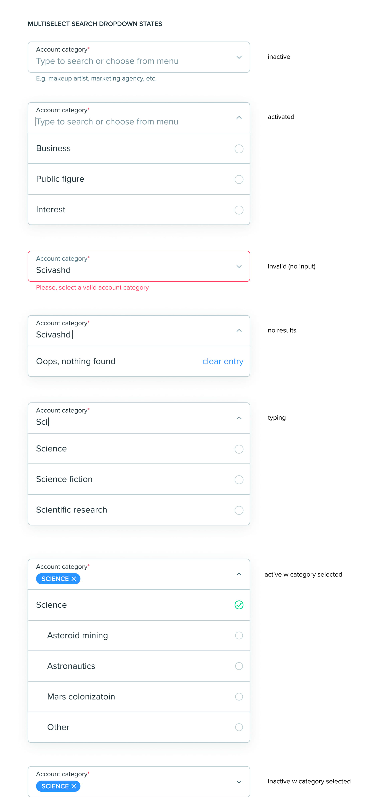

# Testing task vue-dropdown 


### Task Description
```
Video walkthrough: https://www.youtube.com/watch?v=BjEPBfp9SdE

Not covered in video:
1. When you type and there's no value, display ‘no results’ state
2. If you type and abandon the input, and the input is invalid, change input state to ‘error’ (below)

This dropdown has a simpler, but similar behavior (scroll to Multiple Search Selection):
https://semantic-ui.com/modules/dropdown.html

Feel free to use demo values for categorie, but make sure the category examples have at least 3 levels:
=Category
==Subcategory
===Sub-subcategory

It’s described in the video, just emphasizing the importance of: 
a. typing vs choosing
    when you type, it searches all category levels; when you choose – only the available hierarchy. You can’t type when you selected something.  
b. input styles (font size, spacing, shadows, etc.)
```

### Component Design


### Preview
[Online Preview](https://goofy-brahmagupta-632dbf.netlify.app)

### Project setup
```
npm install
```

### Compiles and hot-reloads for development
```
npm run serve
```

### Compiles and minifies for production
```
npm run build
```

### Lints and fixes files
```
npm run lint
```

### Customize configuration
See [Configuration Reference](https://cli.vuejs.org/config/).
